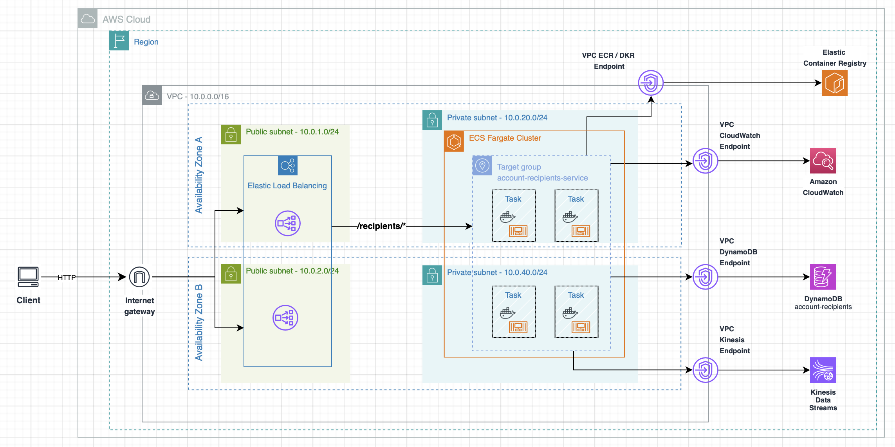

# Account Recipients Service – v1.0

The **Account Recipients Service** is a cloud-native microservice responsible for managing **bank account recipients**.

It exposes RESTful APIs to **create, retrieve, and delete recipients**, while publishing **domain events** to
downstream systems in a **reliable, idempotent, and event-driven** manner.

The service is designed with **scalability, resilience, and maintainability** as first-class concerns, following
**Domain-Driven Design (DDD)**, **Clean / Hexagonal Architecture**, and **event-driven architecture principles**.

---

## 🧱 Architecture Overview

At a high level, the system follows these architectural principles:

- Multi-module Maven project
- Clear separation of concerns
  - Domain
  - Application
  - Infrastructure / Service
- Event-driven architecture
- Idempotent command & event processing
- Cloud-ready and locally reproducible
- Production and local environments share the same configuration model

---

## 🏗️ Runtime Architecture (AWS)

The service runs on AWS using a **fully managed, container-based architecture**, deployed in **private subnets** and
exposed through an **Application Load Balancer**.

  

### Main Components

- **Application Load Balancer (ALB)**
  - Public entry point
  - Routes `/recipients/*` traffic to the ECS service
- **ECS Fargate (Multi-AZ, Private Subnets)**
  - Stateless service tasks
  - Horizontal scaling and self-healing
- **DynamoDB**
  - Primary persistence store for account recipients
  - Accessed via VPC Endpoint (no public internet access)
- **Kinesis Data Streams**
  - Publishes domain events:
    - `recipients.created`
    - `recipients.deleted`
  - Enables asynchronous, decoupled integrations
- **VPC Endpoints**
  - Private connectivity to:
    - DynamoDB
    - Kinesis
    - ECR
    - CloudWatch
  - No outbound internet access required

---

## 📦 Logical Architecture (Code Structure)

The project is organized as a **multi-module Maven setup**, enforcing strict boundaries between layers:

### Domain Module
- Aggregates, entities, and value objects
- Business rules and invariants
- Domain events (e.g. `RecipientCreated`, `RecipientDeleted`)
- No framework or infrastructure dependencies

### Application Module
- Use cases (commands and queries)
- Input and output ports
- Idempotency and transaction boundaries
- Orchestrates domain behavior

### Infrastructure / Service Module
- REST controllers (HTTP API)
- Persistence adapters (DynamoDB)
- Messaging adapters (Kinesis)
- External API clients (Bank Accounts service)
- Configuration, security, and framework integration

This structure ensures that **core business logic remains isolated and testable**, independent of infrastructure
details.

---

## 🔄 Event-Driven Architecture & Data Flow

The service follows an **event-driven workflow**:

1. A client issues a command via HTTP (e.g. create recipient)
2. Application layer validates and executes the use case
3. State is persisted in DynamoDB
4. A domain event is published to Kinesis
5. Downstream consumers react asynchronously

### Idempotency & Reliability

- Commands are idempotent to support safe retries
- Event publication follows **at-least-once delivery**
- Consumers are expected to be idempotent

This guarantees **consistency, fault tolerance, and resilience** in distributed environments.

---

## 🛠️ Tech Stack

### Languages & Frameworks
- Java 17
- Spring Boot 3.x
- Spring MVC
- Spring Boot Actuator
- Spring AOP
- Spring Cloud OpenFeign

---

### Architecture & Design
- Clean Architecture / Hexagonal Architecture
- Domain Events & Integration Events
- Idempotency control
- Multi-module Maven structure

---

### Infrastructure
- Amazon DynamoDB
- Amazon Kinesis Data Streams
- AWS ECS Fargate
- AWS VPC Endpoints
- Docker & Docker Compose
- Terraform
- LocalStack (local AWS simulation)

---

### Observability & Monitoring
- Micrometer
- Prometheus-compatible metrics
- Spring Boot Actuator health checks
- Amazon CloudWatch

---

### Mapping & Utilities
- MapStruct (compile-time mapping)
- Lombok

---

### Testing
- JUnit 5
- Mockito
- AssertJ
- Testcontainers
  - LocalStack
  - Redis
- WireMock
- Rest-Assured
- LogCaptor

---

## ✨ Features

- Recipient Management
  - Create recipients
  - Fetch recipients
  - Delete recipients
- Domain Events
  - `RecipientCreatedEvent`
  - `RecipientDeletedEvent`
- Idempotent Processing
  - Safe retries for commands and events
- Event-driven Integration
  - Kinesis-based messaging
- Observability
  - Metrics exposed for Prometheus
  - Health checks via Actuator
- Local Cloud Simulation
  - Full AWS stack via LocalStack
- CI-ready
  - Designed for GitHub Actions pipelines

---

## 🚀 Summary

This service demonstrates a **production-grade microservice architecture** with:

- strong domain boundaries
- event-driven communication
- cloud-native deployment
- local reproducibility with production parity

It is designed to **scale, evolve, and operate safely** in real-world distributed systems.